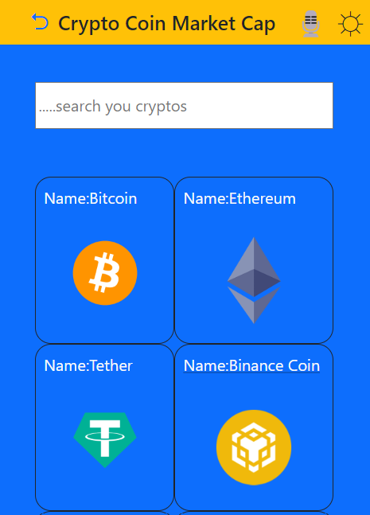
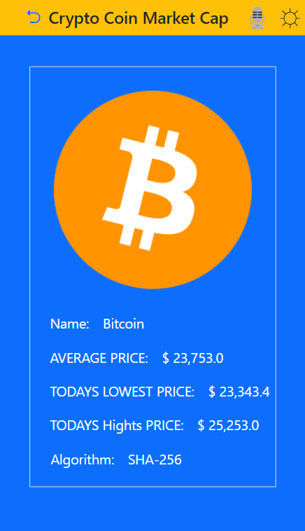
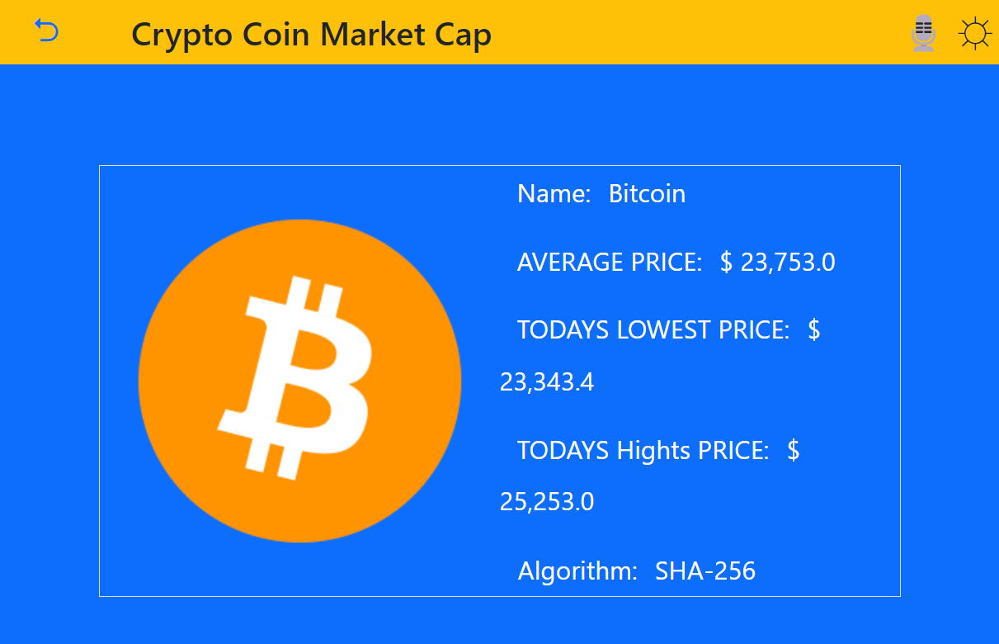

<a name="readme-top"></a>
<div align="center">

<div>

 
 </div>
  
 
  <h1><b>Crypto</b></h1>

</div>

<!-- TABLE OF CONTENTS -->

# 📗 Table of Contents

- [📗 Table of Contents](#-table-of-contents)
- [📖 Crypto ](#-Crypto-)
  - [🛠 Built With ](#-built-with-)
    - [Tech Stack ](#tech-stack-)
    - [Key Features ](#key-features-)
      - [🔭 Future Features ](#-future-features-)
  - [🚀 Live Demo ](#-live-demo-)
  - [🚀 Project Presentation Video ](#-project-presentation-video-)
  - [💻 Getting Started ](#-getting-started-)
    - [Setup](#setup)
    - [Install](#install)
    - [Usage](#usage)
    - [Testing](#testing)
    - [Deployment](#deployment)
  - [👥 Authors](#-authors)
  - [🤝 Contributing ](#-contributing-)
  - [⭐️ Show your support ](#️-show-your-support-)
  - [🙏 Acknowledgments ](#-acknowledgments-)
  - [📝 License ](#-license-)

<!-- PROJECT DESCRIPTION -->

# 📖 Crypto Web-app <a name="about-project"></a>

>  The Crypto Web-app is a website built-with react/redux and Bootstrap. It gives us a real time data on crypto currency:
It display a list of Crypto.
It also gives us name of Crypto, its image, average price, update on todays lowest price, and update on todays highest price, including its Algorithm.


## 🛠 Built With <a name="built-with"></a>

### Tech Stack <a name="tech-stack"></a>

<details>
  <summary>Languages</summary>
  <ul>
    <li>CSS(Bootstrap)</li>
    <li>React/Redux</li>
  </ul>
</details>
<details>
  <summary>Server</summary>
  <ul>
    <li>Github</li>
  </ul>
</details>

<!-- Features -->

### Key Features <a name="key-features"></a>
- **Display a list of Crypto**
- **Find daily update**

<p align="right">(<a href="#readme-top">back to top</a>)</p>

#### 🔭 Future Features <a name="future-features"></a>

- **Add Dark mode**
<!-- LIVE DEMO -->

## 🚀 Live Demo <a name="live-demo"></a>

- <a href="#" target="_blank">[Live Demo Link](https://cryptocurrency-news.onrender.com)</a>

<p align="right">(<a href="#readme-top">back to top</a>)</p>

## 🚀 Project Presentation Video <a name="live-demo"></a>

- [Project Presentation Link](https://www.loom.com/share/204221f6501e4d149570e3030e00c691)

<p align="right">(<a href="#readme-top">back to top</a>)</p>


<!-- GETTING STARTED -->

## 💻 Getting Started <a name="getting-started"></a>

To get a local copy up and running, follow these steps.

### Setup

Clone this repository to your desired folder:

```sh
  git clone https://github.com/bernabasy/Metrics-webapp.git
  cd Metrics-webapp
```

### Install

Install this project with:

```sh
  npm install
```

### Usage

To run the project in a development server, execute the following command:

```sh
  npm start
```

### Testing

To run the tests in a development server, execute the following command:

```sh
  npm test
```

To to build for the production, execute the following command:

```sh
  npm run build
```

### Deployment

You can deploy this project using [Github Pages]()

<p align="right">(<a href="#readme-top">back to top</a>)</p>

<!-- AUTHORS -->

## 👥 Author

<a name="author"></a>

👤 **Bernabas Yosef**

- GitHub: [@githubhandle](https://github.com/bernabasy)
- Twitter: [@twitterhandle](https://twitter.com/@bernabasjosef)
- LinkedIn: [LinkedIn](https://www.linkedin.com/in/bernabas-yosef)

<p align="right">(<a href="#readme-top">back to top</a>)</p>


<p align="right">(<a href="#readme-top">back to top</a>)</p>

<!-- CONTRIBUTING -->

## 🤝 Contributing <a name="contributing"></a>

Contributions, issues, and feature requests are welcome!

Feel free to check the [issues page]().

<p align="right">(<a href="#readme-top">back to top</a>)</p>

<!-- SUPPORT -->

## ⭐️ Show your support <a name="support"></a>

If you like this project give me a star.

<p align="right">(<a href="#readme-top">back to top</a>)</p>

<!-- ACKNOWLEDGEMENTS -->

## 🙏 Acknowledgments <a name="acknowledgements"></a>
- I would like to thank [Creative Commons license of the design](https://creativecommons.org/licenses/by-nc/4.0/)
- I would like to thank Microverse and our fellow micronauts.

<p align="right">(<a href="#readme-top">back to top</a>)</p>

<!-- LICENSE -->

## 📝 License <a name="license"></a>

This project is [MIT](https://github.com/bernabasy/Metrics-webapp/blob/dev/LICENSE) licensed.

<p align="right">(<a href="#readme-top">back to top</a>)</p>
